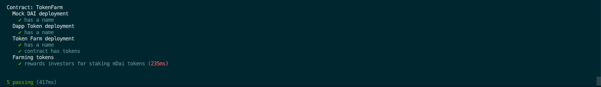

# ✅Ganache-Yild-Farm(Prototype)

このリポジトリはUNCHAINのGANACHE-Yield-Farmというテキストの見本となるプロジェクトです。

### プロジェクトのダウンロード
1. あなたのGithubアカウントにこのレポジトリをフォークしましょう。

2. クローンしたレポジトリをあなたのローカル環境にダウンロードしましょう。

3. ターミナルを開き、ディレクトリのルートで `npm install` を実行します。

### コントラクトのテスト
1. `truffle develop`を実行して開発用のネットワークを立ち上げます

2. `truffle test`を実行してコントラクトのテストを行います。

### フロントエンドの挙動の確認
1. `npm run start` を実行してプロジェクトの挙動を確認します。下のようなメッセージが出ているはずです。

